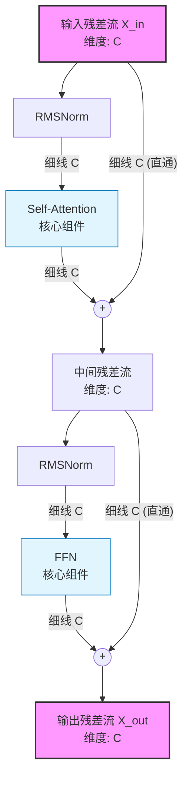
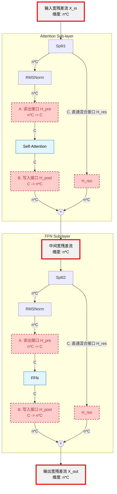

# DeepSeek mHC: 通过流形约束修复 Hyper-Connections 的扩展性缺陷

## 1. 核心思想：从信号危机到流形约束

这项工作的核心出发点回归了 **[ResNet](https://arxiv.org/abs/1512.03385)** 的第一性原理：**恒等映射（Identity Mapping）是深层网络可训练性的基石**。

DeepSeek-AI 团队的 **["mHC: Manifold-Constrained Hyper-Connections"](https://www.arxiv.org/abs/2512.24880)** 提出，近期出现的“超连接”（Hyper-Connections, HC）架构虽然意图通过“加宽”残差流来增强模型表征能力，却无意中破坏了这一基本原则。未受约束的 HC 连接导致信号在深度网络中传播时发生爆炸或消失，引发了“信号危机”，尤其是在大规模训练中表现为极度的不稳定性。

在这个背景下，为了在保留 HC 架构优势的同时恢复 ResNet 的稳定性，层间的混合矩阵必须表现得像一个“广义的恒等映射”，即保持信号的能量（Norm Preservation）。

DeepSeek 的解决方案是引入几何约束：将残差连接矩阵 $\mathcal{H}^{res}$ 强制投影到 **Birkhoff 多面体（Birkhoff Polytope）** 上，使其成为一个**双随机矩阵（Doubly Stochastic Matrix）**。这正是一次教科书级别的**流形优化（Manifold Optimization）**实践：通过将权重硬约束在特定的几何流形上，从架构层面根除不稳定性。在这个流形上，信号的混合在数学上等价于输入特征的**凸组合（Convex Combination）**，从而根本上保证了前向信号和反向梯度的有界性，解决了训练崩溃问题。

## 2. 背景：深度网络基石的演进

### 2.1. 残差连接 (Residual Connection): 深度学习的“高速公路”

在深入 HC 和 mHC 之前，我们必须理解它们试图“改进”的对象：**残差连接**。这是自 ResNet (2015) 以来，几乎所有深度神经网络（包括 Transformer）的“标准配置”。

想象一下，信息在深度网络中逐层传递，就像水流经过层层叠叠的滤网。在传统的网络中，信息必须穿过每一层滤网（计算层），如果网络很深，信息（和梯度）在传递过程中就会严重衰减，这就是“梯度消失”问题，导致深层网络无法训练。

残差连接为此设计了一条“高速公路”或“直通车”。

- **数学形式**: $y = \text{F}(x) + x$
- **直观理解**:
  - $x$ 是输入信息。
  - $\text{F}(x)$ 是对信息进行复杂变换（如卷积、自注意力）的“旁路”。
  - `+ x` 就是“直通车”，它让输入信息 $x$ 可以不经过任何处理，直接跳到下一层。网络要学习的，只是在原始信息基础上的“残差”或“修正量” $\text{F}(x)$。

**核心作用**：这条 `+ x` 的“高速公路”确保了无论网络有多深，梯度总能顺畅地回传，从根本上解决了梯度消失问题，使得训练数百甚至数千层的网络成为可能。这个由加法构成的 **恒等映射 (Identity Mapping)**，就是本文反复强调的、深度学习能够“大力出奇迹”的基石。

### 2.2. Hyper-Connections (HC): “加宽”道路的希望与隐忧

Hyper-Connections (HC) 在 Transformer 架构的长期探索中，并非凭空出现。要理解 mHC 的价值，必须先理解 HC 为何一度被视为希望，又为何在扩展中暴露了其致命缺陷。

“加宽残差流”或“增加拓扑复杂度”的思想由来已久，例如 **[DenseNet](https://arxiv.org/abs/1608.06993) (2017)** 的密集连接。近期，随着 LLM 规模的增长，研究者再次将目光投向宏观架构设计。

**[HC (Hyper-Connections)](https://arxiv.org/abs/2409.19606)** 这个具体的框架由 **Zhu 等人 (2024)（字节跳动）** 正式提出。他们开创性地将残差流的宽度扩展为 $n$ 倍，并引入三个可学习的矩阵 ($\mathcal{H}^{pre}, \mathcal{H}^{post}, \mathcal{H}^{res}$) 来管理这个“宽体”连接。

#### HC 的核心优势

根据其原始论文，HC 旨在替代传统残差连接，解决梯度消失和表征坍塌的难题。其在多个场景下表现出显著优势，堪称“免费的午餐”式的架构升级，因为它几乎不增加 FLOPs 和推理内存。

- **LLM 预训练（稠密 & MoE）**: 在 1B-7B 规模的稠密模型上，HC 能**加快收敛**。在 **MoE 架构上收益尤其显著**，收敛速度可提升 **1.8 倍**，并在 ARC-C 任务上带来 **6%** 的巨大提升。
- **计算机视觉任务（ViT & DiT）**: 在 ViT-Large 上带来 **2.69%** 的性能提升。在 DiT（图像生成）上，引入 HC 的模型，其性能与**参数量多 50%** 的基线模型相当。
- **理论优势**: HC 具备**动态层级重组**能力，网络可以自主学习采用“串行”还是“并行”模式。

#### 共同的缺陷：被破坏的“恒等映射”

然而，尽管 HC 在 7B 规模下取得了成功，但它与 [RMT](https://arxiv.org/abs/2304.11062)、[MUDDFormer](https://arxiv.org/abs/2502.12170) 等探索一样，都存在一个共同的致命缺陷。DeepSeek 在论文中一针见血地指出：

> "Despite their potential, these approaches compromise the inherent identity mapping property of the residual connection, thereby introducing instability and hindering scalability."

翻译过来就是：尽管有潜力，但这些方法**破坏了残差连接固有的恒等映射属性，从而引入了不稳定性并阻碍了可扩展性**。当模型规模扩展到 27B 级别，这种稳定性问题便不再是隐忧，而是会直接导致训练崩溃的“明患”。

## 3. 架构演进：从标准 Transformer 到 mHC

### 3.1. 标准 Transformer

传统的 Transformer 中，残差流 $x$ 的维度 $C$ 与计算单元（Attention/FFN）的维度紧密耦合。

### 3.2. Hyper-Connections (HC)

HC 架构试图解耦残差流和计算流。它将残差流的宽度扩展为 $n \times C$，作为一个高容量的“工作记忆区”，而计算层（Attention/FFN）依然在 $C$ 维度上进行，作为“推理区”。

## 4. HC 的致命缺陷：信号传播的“复利效应”

HC 的核心修改在于将残差连接 $x_{l+1} = x_l + F(x_l)$ 变为 $x_{l+1} = \mathcal{H}^{res}_l x_l + F(x_l)$。这个看似简单的线性混合，却在深度网络中引入了灾难性的“复利效应”。

- **加法 vs. 乘法**：标准 ResNet 的信号传播是**加法**关系 ($x_L \approx x_l + \sum F_i$)，梯度可以直接回传。而 HC 的传播是**乘法**关系 ($x_L \approx (\prod \mathcal{H}_i) x_l + \dots$)。
- **信号爆炸**：这是一个典型的**深度线性网络（Deep Linear Network）** 问题。如果无约束矩阵 $\mathcal{H}$ 的谱半径（最大奇异值）略大于 1，经过数十层网络后，信号强度将呈指数级增长。论文图 3(b) 显示，原版 HC 的复合增益幅度可达 **3000** 倍。
- **前向与反向传播的不对称性**：对于 $y = Ax$ 操作，矩阵 $A$ 的**行和 (Row Sum)** 决定了前向传播的增益，而其**列和 (Column Sum)** 则决定了反向传播中梯度的增益（因梯度计算涉及 $A^\top$）。原版 HC 对这两者都没有任何约束。

**这对“扩展性”是致命的**：随着层数 $L$ 的增加，HC 的误差累积呈指数级 $O(\sigma^L)$。这意味着模型越深，训练越难，最终导致在扩大模型规模时必然会遇到训练崩溃。

## 5. mHC 的数学机理：Birkhoff 流形与 Sinkhorn 投影

mHC 的数学核心在于如何高效地将 $\mathcal{H}^{res}$ 约束在 Birkhoff 多面体内。

### 5.1. 流形约束：双随机矩阵

作者强制 $\mathcal{H}^{res}_l$ 属于双随机矩阵集合，即满足：

1. **非负性：** $\mathcal{H}^{res}_{ij} \ge 0$
2. **行和为 1：** $\mathcal{H}^{res} \mathbf{1} = \mathbf{1}$
3. **列和为 1：** $\mathbf{1}^\top \mathcal{H}^{res} = \mathbf{1}^\top$

### 5.2. 实现算法：Sinkhorn-Knopp 迭代

为了将一个无约束的 logits 矩阵 $\tilde{\mathcal{H}}^{res}$ 转化为双随机矩阵，作者使用了经典的 Sinkhorn-Knopp 算法。从一个正矩阵 $M^{(0)} = \exp(\tilde{\mathcal{H}}^{res})$ 开始，交替进行行归一化和列归一化，迭代少量次数（如 20 次）即可收敛。

$$M^{(t)} = \text{RowNorm}(\text{ColNorm}(M^{(t-1)}))$$

### 5.3. 理论保证：谱范数控制与稳定性

- **范数非扩张性：** 双随机矩阵的谱范数（最大奇异值）$\|\mathcal{H}^{res}\|_2 \le 1$。这从根本上杜绝了信号爆炸的可能。
- **闭包性质：** 两个双随机矩阵的乘积依然是双随机矩阵，保证了全局稳定性。

### 5.4. 几何选择：Birkhoff 多面体 vs. Stiefel 流形

为了保证稳定性，一个自然的想法是使用**正交矩阵**（Orthogonal Matrix），它能完美保持信号能量（保距性），构成 **Stiefel 流形**。然而，DeepSeek 选择了 Birkhoff 多面体，这背后是深刻的权衡：

- **正交矩阵（Stiefel 流形）的本质是“旋转”**：它能保持特征的多样性，但**不擅长“混合”**。
- **双随机矩阵（Birkhoff 多面体）的本质是“凸组合”**：它执行的是一种**加权平均（Averaging/Mixing）**，更符合多条残差流之间信息交换的直觉。

有趣的是，Birkhoff 多面体的顶点恰好是**置换矩阵（Permutation Matrices）**，而置换矩阵本身就是正交矩阵。因此，mHC 的训练过程，允许模型在“保持特征独立性”（推向顶点）和“促进信息融合”（推向中心）之间动态权衡。

### 5.5. 实现手段：从“软正则”到“硬重参数化”

许多工作尝试通过在损失函数中加入惩罚项来约束权重，这是一种**软约束（Soft Constraint）**。但这种方法依赖于超参数且可能失效。

DeepSeek 采用了更强大的**重参数化（Reparameterization）**，即 $\mathcal{H}^{res} = \text{Sinkhorn}(\tilde{\mathcal{H}}^{res})$。这是一种**硬约束（Hard Constraint）**：无论底层的 $\tilde{\mathcal{H}}^{res}$ 如何变化，其输出永远位于 Birkhoff 流形上，提供了绝对的数值稳定性保障。

## 6. 逆向工程：DeepSeek 如何发现并修复问题

如果我们站在 DeepSeek 研究员的角度，可以推演出他们发现问题的完整逻辑链：

### 6.1. 第一阶段：扩展性验证与失败 (The "Crash")

- **现象**：在将 HC 架构从小型模型扩展到大规模的 27B MoE 模型时，训练 Loss 出现剧烈尖峰（Spike）。
- **证据**：论文 Figure 2(a) 显示，27B 模型的 HC 曲线在 12k 步附近出现了明显的 Loss 飙升，这在工程上通常意味着训练已经失败。

### 6.2. 第二阶段：取证分析 (Forensics)

- **观察**：检查梯度范数（Gradient Norm），发现其持续高于基线，并在 Loss 尖峰处剧烈抖动（Figure 2b），表明训练过程极不稳定。
- **归因分析**：面对梯度爆炸，自然的怀疑是 Attention 内部不稳定。但问题特征（全局梯度范数持续偏高、随深度加剧）更指向 Attention **外部**的主干道。DeepSeek 团队通过排除法，将疑点集中在了 HC 独有的、具有深度累积效应的 $\mathcal{H}^{res}$ 矩阵上。

### 6.3. 第三阶段：数学诊断 (The "Probe")

- **设计探针**：设计关键实验（论文图 3），不只看单个矩阵，而是计算**累积乘积** $\prod \mathcal{H}_i$ 的性质。
- **确凿证据**：观察到累积增益幅度飙升至 $10^3$ 数量级，获得了数学上的实锤：**恒等映射属性被严重破坏。**

### 6.4. 第四阶段：第一性原理的修复 (The Fix)

- **系统性方案权衡**：目标是寻找一种矩阵 $M$，使得 $x_{new} = M x_{old}$ 操作在深度累积后信号能量依然稳定。
  - **路径 1：刚性旋转（正交矩阵）**：能完美保持向量长度，但强制施加正交约束计算量巨大且优化困难。**结论：不切实际。**
  - **路径 2：离散交换（置换矩阵）**：能完美保范数并混合信息，但它是离散的，无法通过梯度下降进行训练。**结论：不可微。**
  - **路径 3：软性交换（双随机矩阵）**：既然“硬交换”不可微，能否做“软交换”？例如：新通道 = 30% 旧通道1 + 70% 旧通道2。这种凸组合思想，其数学形式正是**双随机矩阵**。
- **最终选择**：双随机矩阵是在**可训练性（可微）**、**稳定性（谱范数≤1）**和**计算效率（高效的 Sinkhorn-Knopp 算法）** 三者之间找到的唯一且最优的数学交集。

## 7. 工程实现：对抗“内存墙”与通信开销

将残差流扩大 $n$ 倍（如 $n=4$）会带来巨大的内存和通信挑战。DeepSeek 通过极致的系统级优化，将 mHC 的理论优势成功落地。

- **挑战 1：内存墙**：RMSNorm 和残差加法的数据搬运量增加 $n$ 倍。
  - **解决方案：算子融合 (Kernel Fusion)**。使用 TileLang 开发自定义 CUDA 内核，将多个操作融合在单个内核中，避免反复读写 HBM。

- **挑战 2：显存占用**：存储宽残差流的中间激活值会导致显存爆炸。
  - **解决方案：分块重计算 (Block-wise Recomputing)**。在前向传播后丢弃 mHC 的中间激活，反向传播时以块为单位进行重计算。

- **挑战 3：流水线并行气泡**：宽残差流导致跨节点的 Send/Recv 通信量增加 $n$ 倍。
  - **解决方案：修改版 DualPipe**。调整流水线调度策略，将 FFN 的通信设为高优先级，有效掩盖增加的通信延迟。

**最终结果：** 在 27B 参数模型、扩展率 $n=4$ 的情况下，mHC 相比基线仅增加了 **6.7%** 的训练时间开销，却取得了显著的 loss 下降（-0.021），并完全消除了原版 HC 的训练不稳定性。

## 8. 批判性分析与深层探讨

字节跳动和 DeepSeek 做得很好，不过“鸡蛋里挑骨头“，有几个点，我觉得仍有值得探讨的价值：

1. **“免费午餐”的阴暗面：推理时的带宽税**
   分析强调 mHC“几乎不增加 FLOPs”，但在 LLM 推理中，瓶颈通常是**内存带宽**而非计算。残差流 $x_l$ 的数据搬运量增加了 **$n$ 倍**。在长上下文或高并发推理场景下，这是否会导致 Token 生成速度（TPS）因显存带宽打满而下降？

2. **理论权衡：稳定性与表达能力的博弈**
   双随机矩阵带来了宝贵的稳定性，但这种强约束是否也扼杀了模型的潜力？无约束的 HC 矩阵可以学习任意变换，而双随机矩阵只是其中一个微小的子集。这种约束是否意味着我们人为地“阉割”了模型进行某些剧烈状态转换的能力？

3. **超参数 $n$ 的敏感度与边际递减**
   随着 $n$ 增大，残差流的“信息带宽”增加，但 I/O 开销也随之增加。这种收益何时会达到边际递减的拐点？对于不同规模的模型，最佳的 $n$ 是否相同？

4. **为什么是“双随机”而不是其他？**
   为什么不简单地对 $\mathcal{H}$ 矩阵做 `Softmax` 归一化？选择保证行列和同时为 1 的双随机矩阵，暗示了 DeepSeek 极其看重**前向和反向传播的对称稳定性**。只做行归一化（Softmax）能稳定前向传播，但反向传播的梯度方差可能仍不稳定。

5. **初始化策略的“暗黑艺术”**
   $\mathcal{H}^{res}$ 是如何初始化的？如果初始化不当，Sinkhorn 迭代可能收敛到“平凡解”（如所有元素为 $1/n$ 的均匀矩阵），导致信息过度混合。是接近单位矩阵以保持残差特性，还是接近均匀分布以鼓励早期探索？

## 9. 总结

DeepSeek 的这项工作没有发明新的注意力机制，而是对 Transformer 的**骨架（Backbone）**进行了一次深刻的“外科手术”。

1. **发现了什么**：指出了 Hyper-Connections 架构破坏恒等映射守恒性这一致命缺陷，并解释了其导致大规模训练失败的数学根源。
2. **做了什么**：提出 mHC，通过将残差连接矩阵约束在双随机流形上，既保留了 HC 的拓扑优势，又从根本上保证了信号传播的稳定性。
3. **结果如何**：在 27B 规模的模型上，mHC 实现了比标准 Transformer 和原始 HC 更低的 Loss 和更强的下游性能，同时通过极致的系统优化将额外开销控制在了可接受的范围内。

这篇论文再次印证了 DeepSeek 的研究风格：**极其敏锐的数学物理直觉，辅以世界顶级的系统工程落地能力**。

## 10. 附录：谱范数视角下的 mHC

许多旨在提升稳定性的工作（如 SRIP）其核心目标是约束权重矩阵的**谱范数（Spectral Norm，即最大奇异值 $\sigma_{max}$）** 使其接近 1。mHC 通过其设计“免费”地实现了此目标的关键部分：

- **构造性正则化（Constructive Regularization）**：根据数学定理，任何双随机矩阵的谱范数必然满足 $\sigma_{max} \le 1$。这意味着 DeepSeek 无需计算昂贵的 SVD 来强制施加谱范数约束，而是通过 Sinkhorn 投影这一构造性方法，直接保证了信号不会爆炸。
- **对梯度消失的权衡**：虽然正交矩阵能保证 $\sigma_{max} = 1$，但双随机矩阵的约束（$\sigma_{max} \le 1$）理论上存在导致梯度消失的风险。然而，在残差网络 $x_{l+1} = \mathcal{H}x_l + F(x)$ 的框架下，只要主干道 $\mathcal{H}x_l$ 不引发爆炸，旁路 $F(x)$ 的存在通常足以维持梯度的有效流动。
